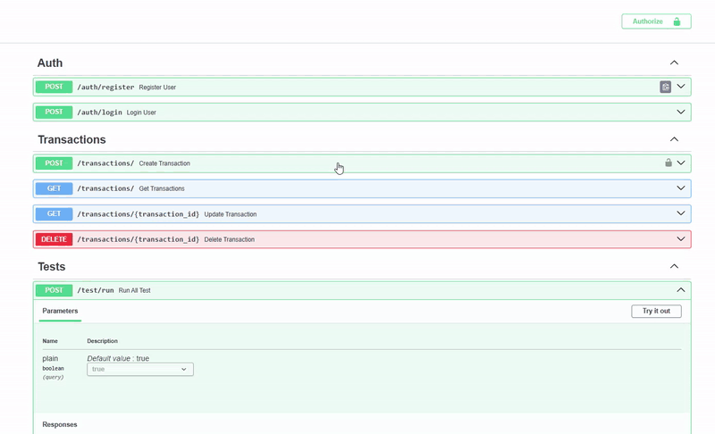

# Currency Converter API

*Currency Converter API* is a complete backend project built with FastAPI, MySQL, and Docker, including jwt authentication, currency conversion integration, and automated testing with pytest and GitHub Actions

## Features

* User registration and login with encrypted passwords
* JWT token generation and validation
* Creation, listing, search, and deletion of conversion transactions
* Integration with an external exchange rate API
* Automated tests through an internal API endpoint
* CI/CD pipeline
* Execution logs automatically saved inside the container (I plan to use S3 with boto to integrate logs with AWS)


## Run Configuration

Initialize with Docker:

```
docker compose up --build
```

Swagger URL:

```
http://127.0.0.1:8000/docs/
```

## Endpoint Structure

| Method   | Route                | Description                         |
| -------- | -------------------- | ----------------------------------- |
| `POST`   | `/auth/register`     | Creates a new user                  |
| `POST`   | `/auth/login`        | Logs in and returns a JWT           |
| `POST`   | `/transactions/`     | Creates a new transaction           |
| `GET`    | `/transactions/{id}` | Retrieves a transaction by ID       |
| `GET`    | `/transactions/`     | Lists all user transactions         |
| `DELETE` | `/transactions/{id}` | Deletes a transaction               |
| `POST`   | `/test/run`          | Runs automated tests inside the API |

## CI/CD

The CI workflow:

* Installs dependencies
* Initializes the database
* Runs tests with pytest

## Security

* Passwords hashed with bcrypt
* JWT with expiration time
* Sensitive variables managed through env or docker-compose

## Currency API

URL to generate your authentication key (usage limit applies):

```
https://app.currencyapi.com/login
```

## Usage Flow via Swagger for Testing
***obs*** The video will only appear in the local repository.

[]

## Sources Used

FastAPI — https://fastapi.tiangolo.com/ 
SQLAlchemy — https://docs.sqlalchemy.org/ 
Docker — https://docs.docker.com/ 
GitHub Actions — https://docs.github.com/actions 
Pydantic — https://pydantic-docs.helpmanual.io/
HTTPX — https://www.python-httpx.org/ 
pytest — https://docs.pytest.org/en/stable/contents.html 
MySQL — https://dev.mysql.com/ 
Uvicorn — https://www.uvicorn.org/ 
Docker Compose — https://github.com/docker/compose

## Notes

Even though this project has a solid structure and flow, it was built with an educational purpose — to demonstrate my understanding of architecture, integration of technologies, and backend engineering. It does not represent a production system, but I aimed to get as close as possible due to my strong interest in the position.If you notice any areas for improvement, please let me know — I’m constantly learning.
It’s also worth mentioning that I used as little autocomplete as possible (honesty builds trust).

**Thank you in advance!**
